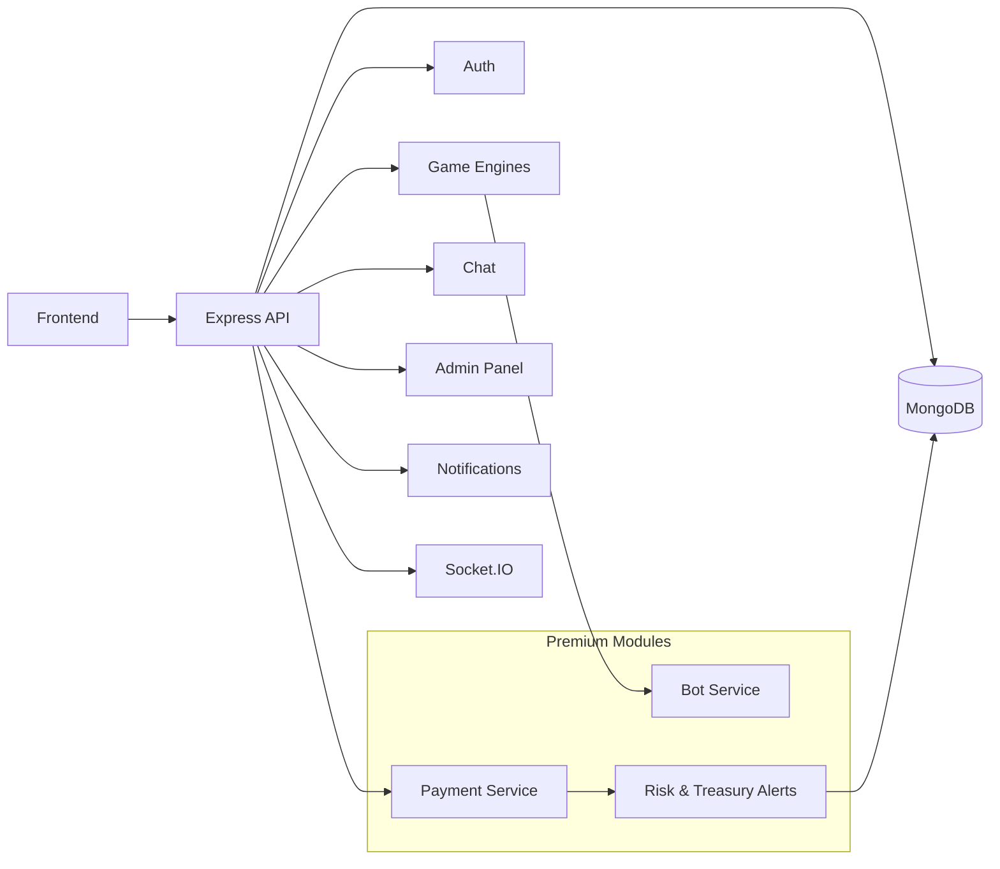

# Crypto Casino Gaming Platform - Crash, Roulette, Jackpot, Coinflip, Mines ...

Welcome to Crypto Gaming Hub, a modern cryptocurrency casino gaming platform built with Next.js. This platform offers multiple provably fair games including Coinflip, Crash, Mines, and Roulette.  
  
[Live link](https://www.bet366.casino/)  


*Main dashboard showing all available games*

## Overview

REST and real-time backend for a crypto-enabled betting platform. The design prioritizes low-latency gameplay, real-time collaboration, and operational controls, while remaining straightforward to run and extend locally.

This repository contains the **public core**: shared API, persistence, authentication, Socket.IO, and notifications. **Payment processing** and **bot service** modules are not included; they are distributed separately. The architecture diagram below illustrates the full system so integrations points are visible.

---

## Architecture

| Layer | Responsibility |
|--------|----------------|
| **API** | Express.js REST: authentication, users, games metadata, history, admin |
| **Real-time** | Socket.IO for live game state, chat, and dashboards |
| **Games** | Crash, Mine, Roulette, Coinflip, and related engines ship with the **private** backend. In this public build, game HTTP routes and game Socket.IO handlers are **disabled** |
| **Data** | MongoDB (users, balances, bets, history, notifications, configuration) |
| **Security** | JWT, wallet signatures, validation, rate limiting |
| **Notifications** | Email (EmailJS) and in-app notifications |

**Premium / private (not in this repo):** blockchain settlement, deposit and withdrawal flows, autonomous bot players, and extended risk or treasury automation.

### System diagram (full vision, including premium modules)



In this shared backend you deploy the core API, MongoDB, EmailJS, and Socket.IO. Premium layers attach at the integration points shown above.

---

## Tech stack

- **Runtime:** Node.js  
- **HTTP:** Express.js  
- **Database:** MongoDB, Mongoose  
- **WebSocket:** Socket.IO  
- **Auth:** JWT, wallet signatures, optional Supabase  
- **Email:** EmailJS  
- **Hardening:** Helmet, CORS, rate limiting  

---

## Prerequisites

- Node.js 16 or later  
- MongoDB (local or hosted), e.g. `mongodb://localhost:27017/your_db_name`  

---

## Quick start

### 1. Install dependencies

```bash
npm install
```

### 2. Configure environment

```bash
cp env.example .env
```

**Minimum for local development**

- `MONGODB_URI` — connection string  
- `FRONTEND_URL` — frontend origin for CORS (e.g. `http://localhost:3000`)  
- `JWT_SECRET` — set in `.env` (not committed); use a strong value outside development  

Payment and bot-related variables are **not** required for this build.

### 3. Start the server

```bash
npm start
```

**Note:** The public release may ship with compiled output under `build/` while TypeScript sources for private game engines under `src/` may be absent.

- Prefer **`npm start`** when working from this repository as distributed.  
- `npm run dev` and `npm run build` may fail without the full private source tree.  
- Maintainers with the complete codebase can use `npm run dev` as usual.

The server listens over HTTP (HTTPS is not configured in this shared build). The listening port is `PORT` from `.env` (default example: `3001`).

### 4. Verify health

Open `http://localhost:3001/health`. Expected response shape:

```json
{ "status": "OK", "timestamp": "..." }
```

---

## Environment variables

Treat `env.example` as a template only; never commit production secrets.

### Core

| Variable | Required | Description |
|----------|----------|-------------|
| `MONGODB_URI` | Yes | MongoDB connection string |
| `PORT` | No | HTTP port (default often `3001`) |
| `NODE_ENV` | No | `development` or `production` |
| `FRONTEND_URL` | Recommended | Primary frontend origin (CORS) |
| `ADMIN_FRONTEND_URL` | No | Admin UI origin (CORS) |
| `ALLOWED_ORIGINS` | No | Additional comma-separated CORS origins |

### Authentication and rate limiting

| Variable | Notes |
|----------|--------|
| `JWT_SECRET` | Required for production; dev fallback exists but must not be used in production |
| `RATE_LIMIT_WINDOW_MS`, `RATE_LIMIT_MAX_REQUESTS` | General API rate limits |
| `AUTH_RATE_LIMIT_WINDOW_MS`, `AUTH_RATE_LIMIT_MAX_REQUESTS` | Auth route limits |

### Email and application identity

- `EMAILJS_SERVICE_ID`, `EMAILJS_PUBLIC_KEY`, `EMAILJS_PRIVATE_KEY`  
- `EMAILJS_OTP_TEMPLATE_ID`, `EMAILJS_VERIFICATION_TEMPLATE_ID`, `EMAILJS_WELCOME_TEMPLATE_ID`  
- `APP_NAME` — branding in email and UI copy  

If EmailJS is not configured, email features log warnings and skip delivery.

### Supabase (optional)

`SUPABASE_URL`, `SUPABASE_ANON_KEY`, `SUPABASE_SERVICE_ROLE_KEY` — used by `supabaseAuth` middleware. Omit if Supabase is unused.

### Solana and treasury (private / full builds)

- `NETWORK` — e.g. `devnet`  
- `TREASURY` — treasury key material (highly sensitive; never in public repos or real values in samples)  

### Logging and alerting

`MB_LOG_LEVEL`, `MB_LOG_MAX_FILES`, `MB_LOG_FLUSH_MS`, `MB_LOG_HOOK_LEVEL`, `SLACK_WEBHOOK_URL`, `TELEGRAM_BOT_TOKEN`, `TELEGRAM_CHAT_ID`, `DISCORD_WEBHOOK_URL` — structured logging and optional alert hooks.

### Admin bootstrap

- `ADMIN_BOOTSTRAP_TOKEN` — one-time token for initial admin creation  
- `ADMIN_EMAIL`, `ADMIN_USERNAME`, `ADMIN_DISPLAY_NAME` — defaults for the bootstrap user  

Rotate or discard `ADMIN_BOOTSTRAP_TOKEN` after use in production.

---

## Premium modules (outside this repository)

The following are **not** part of the public codebase but are referenced in the diagram for integration planning:

- **Payments** — gateways, webhooks, deposit and withdrawal tracking, reconciliation, on-chain mapping; credentials such as `NOWPAYMENTS_*`, `CRYPTOPAY_*`, and RSA material belong only in private configuration.  
- **Bot service** — configurable automated players for load and game-specific strategies; isolated from the public demo build.  

Business-specific compliance, treasury policy, and provider choice remain in private deployments; this repository provides the auditable API and real-time core.

---

## Security: full / private builds

Do not publish the following in public repositories or shared sample environments:

- **Secrets:** `JWT_SECRET`, `ADMIN_BOOTSTRAP_TOKEN`, `TREASURY`, Supabase service role key, payment API keys, EmailJS private key, bot-related keys.  
- **Operational data:** production `MONGODB_URI`, production URLs, internal admin endpoints, webhook signing secrets.  

The public core does not require payment or bot secrets to run locally.

---

## Support

If you have any questions or would like a more customized app for specific use cases, please feel free to contact us at the contact information below.
- E-Mail: admin@hyperbuildx.com
- Telegram: [@hyperbuildx](https://t.me/hyperbuildx)

---

**Happy Gaming! 🎰🎮💎**
